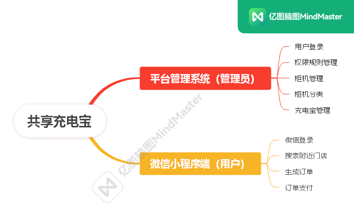
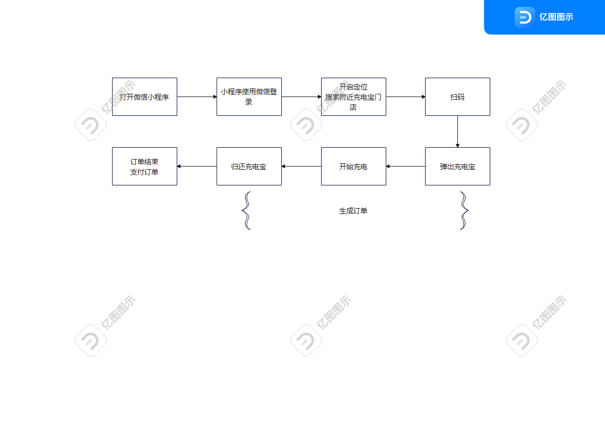
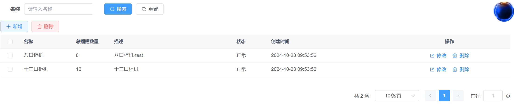
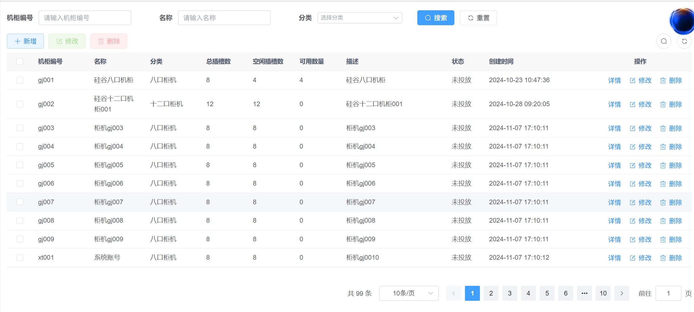
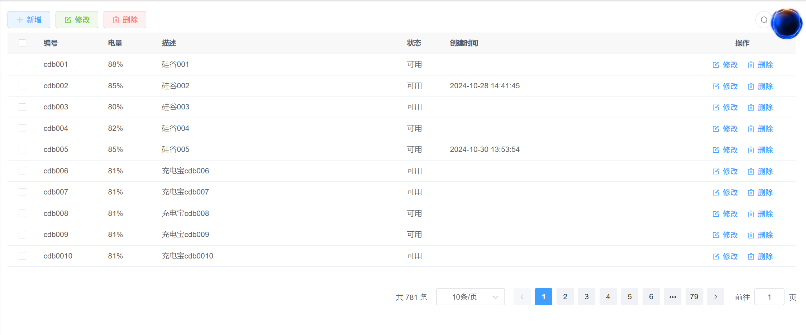
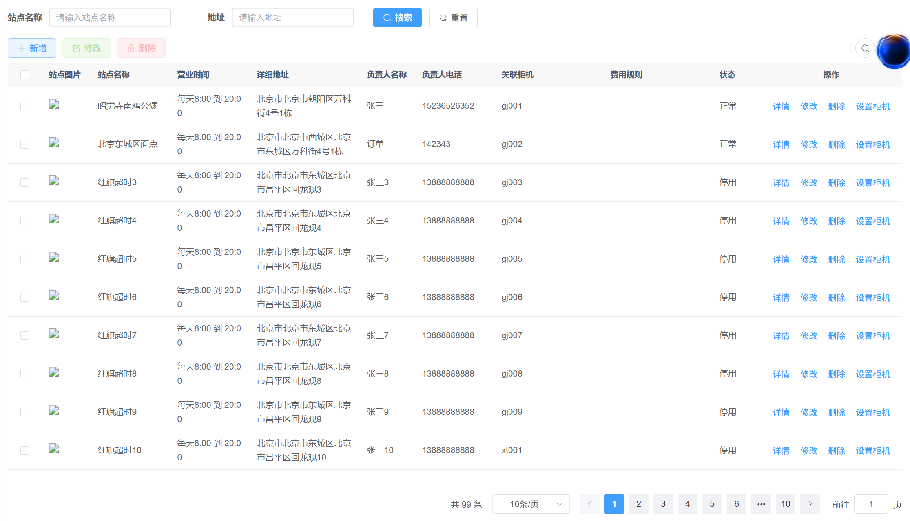

# 共享充电宝

## 1. 背景
`共享充电宝`是基于`若依`微服务版本框架开发的一个共享系统，项目包含平台管理端与微信小程序端，是一个前后端分离的项目。共享充电宝分为后台系统和前台微信小程序。

流程图

## 2. 准备环境
### 2.1 准备软件环境
* docker
* mysql
* redis
* minio
* rabbitmq
* mongodb

使用docker-compose，见prepare目录下docker-compose.yml文件

### 2.2 搭建项目后端环境
1. 导入若依项目模板

下载”[RuoYi-Cloud 微服务版](https://ruoyi.vip/)“

2. 准备mysql数据
见prepare目录下database.sql文件

3. 准备nacos配置
导入prepare/nacos-config目录下yaml文件

### 2.3 搭建项目前端环境
1. 后台管理系统前端
* webstorm开发工具
* nodejs

2. 用户系统前端（小程序）
* 微信开发者工具[安装](https://developers.weixin.qq.com/miniprogram/dev/devtools/download.html)

## 3. 后台管理系统
- 设备管理
  - 柜机类型

  - 柜机管理

  - 充电宝管理

  - 站点管理

## 4. 用户系统
### 4.1 微信授权登录
官方文档：https://developers.weixin.qq.com/miniprogram/dev/framework/open-ability/login.html

### 4.2 搜索附近站点

### 4.3 扫码获取充电宝
#### 4.3.1 扫码前判断
1. 是否免押金：根据微信支付分判断是否免押金 
2. 是否有充电中订单：如果有，则不能扫码，系统给出提示 
3. 是否有未支付订单，如果有，则调整到未支付页面，去支付

只有这三个条件都满足了，才可以正常扫码

#### 4.3.2 扫码

扫码主要是用户微信小程序获取柜机的唯一标识，微信小程序获取到柜机标识与服务器端通信，服务器端根据柜机标识获取空闲且电量最多的充电宝与对应卡槽，然后发送Mqtt消息给柜机，柜机收到消息，解析消息并弹出充电宝，弹出后发送弹出成功Mqtt消息给服务器端，服务器端生成订单信息。

#### 4.3.3 归还

用户使用完充电宝，直接插入任意匹配的柜机，柜机识别充电宝归还信息，发送Mqtt消息给服务器端，服务器端结束对应充电宝的订单，并计算费用，然后走微信支付流程

#### 4.3.4 支付订单
通过调用微信支付的[api接口](https://pay.weixin.qq.com/wiki/doc/apiv3/apis/chapter3_5_1.shtml)，完成支付。
1. 通过微信调用小程序注册的回调接口，更新订单的支付状态
2. 通过轮询订单的微信支付是否成功，更新订单的支付状态

